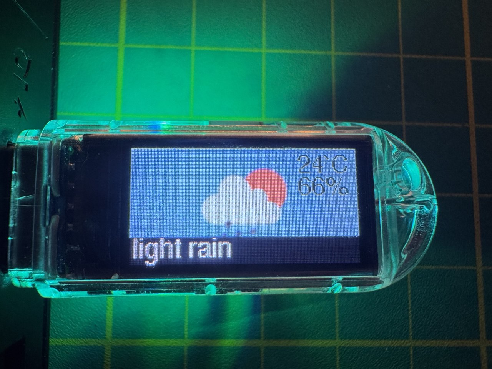

# T-Dongle-S3-forecaster
A simple weather forecaster using open [weather map API](https://openweathermap.org/api). 
Built for [T-Dongle-S3](https://github.com/Xinyuan-LilyGO/T-Dongle-S3)

# ✏️ Setup 
- rename "secrets_example.h" to "secrets.h" and edit it accordingly
- rename "weatherParamsExample.h" to "weatherParams.h" and edit it accordingly

# ⚠️ Warning
Use TFT_eSPI with version <= 2.0.14 as wrote [here](https://github.com/Xinyuan-LilyGO/T-Dongle-S3) 

# 📷 

